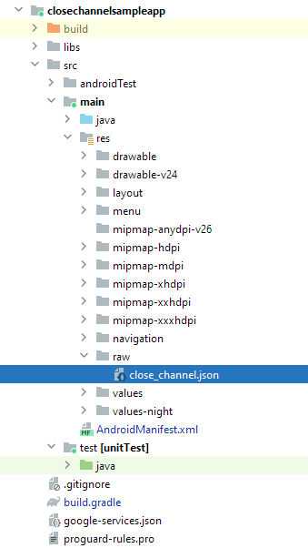

# Problems and solutions

## Compile errors

### Adding the close framework

#### "Build was configured to prefer settings repositories over project repositories but repository ‘GitHubPackages’ was added by build file ‘build.gradle’"
You have to place the repository as part of the `settings.gradle`. Please look up the repository section in the `settings.gradle` file and add there the repositories. Remove it from the `build.gradle`
<details>
<summary>example settings.gradle</summary>

```
pluginManagement {
    repositories {
        gradlePluginPortal()
        google()
        mavenCentral()
    }
}
dependencyResolutionManagement {
    repositoriesMode.set(RepositoriesMode.FAIL_ON_PROJECT_REPOS)
    repositories {
        google()
        mavenCentral()
        jcenter()
        maven {
            name = "GitHubPackages"
            url = uri("https://maven.pkg.github.com/close-dev-team/mobile-close-channel-sdk-android")
            credentials {
                username = user
                password = key
            }
        }
    }
}
rootProject.name = "SdkTest"
include ':app'
```
</details>


#### "Could not find org.jetbrains.anko:anko-common..."
It tries to find anko (that is used by our SDK), but it can't find it. </br>
You have to add jcenter to the list of repositories
```
    repositories {
        ...
        jcenter()
        ...
    }
```
You can also check out the example above

#### "Duplicate class android.support.customtabs.... found in modules ..."
You have to enable jetifier as part of the `gradle.properties` file</br>
So open `gradle.properties` and add or change the property
```
android.enableJetifier=true
```
#### "Error: uses-sdk:minSdkVersion 21 cannot be smaller than version 23 declared in library com.thecloseapp.close:close-channel:..."
You probably have minSdk 22 (or lower). Unfortunatly we currently do not support that minSDK. Please contact us, if that is an issue.

Change in the `build.gradle` the minSdk to 23
```    
    defaultConfig {
        ...
        minSdk 23
        ...
    }
```


#### "Manifest merger failed : android:exported needs to be explicitly specified for element ..."
You probably have targetSdk 31 (or higher). Unfortunatly we currently do not support that targetSdk. Please contact us, if that is an issue.

Change in the `build.gradle` the targetSdk to 30
```    
    defaultConfig {
        ...
        targetSdk 30
        ...
    }
```

For more info about adding the SDK check out the README under section [Step 1: Adding the SDK](../README.md#step-1-adding-the-sdk)

## Run-time errors

### Configuring the API base URL
When setting up the close channel config, if there is an error in the logging, this can be done to resolve it.

#### "Configuration file was not found"

There should be a file called `close_channel.json` in the `(project)/src/main/res/raw directory`. 



#### "api_base_url property was not found"

In the `close_channel.json` there should be a property called `api_base_url` and it should be filled with the url of the api of the Close SDK
i.e. 
```json
{
    "api_base_url": "https://api.sdk-sandbox.closetest.nl:16443/"
}
```

#### "api_base_url (...) is not a valid url"

There should be a property called 'api_base_url' and it should be filled with the url of the api of the Close SDK. 
Please check the url if it is formatted correctly. i.e. check the url in a browser.

#### More info
For more info about configuration check out the README under section [Step 2: Using the SDK](../README.md#step-2-using-the-sdk).

